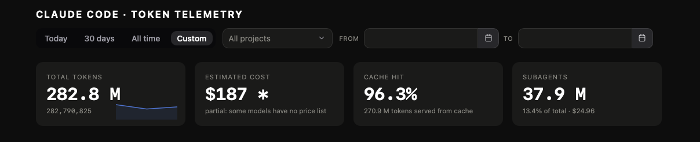
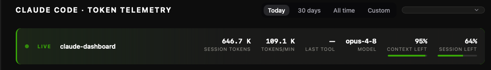

# CCTelemetry

> **See exactly where your Claude Code tokens go.** A local, real-time desktop dashboard for token usage, cost, and per-tool / model / project / session breakdowns — living quietly in your menu bar.

<p>
  
  
  
  
</p>

CCTelemetry reads the session transcripts Claude Code already writes to `~/.claude/projects/**/*.jsonl` — **no API keys, no cloud, nothing ever leaves your machine.** It sits in your menu bar showing your live 5-hour usage %, and opens into a full dashboard on click. Because it just parses files that are already on disk, it works retroactively on your entire history from day one.

## Screenshots





## Features

- **Tray / menu bar icon** — the Claude starburst with the **5-hour session usage %** next to it (macOS; on Windows the % is in the tooltip). Hovering shows the tooltip: the 5-hour window's used % and reset time, a divider, then the weekly window's used % and reset time. These come from Anthropic's OAuth usage endpoint (the same rate-limit windows [cclimits](https://github.com/cruzanstx/cclimits) reports), refreshed every 60s. Left-click opens the dashboard window; closing the window hides it back to the tray.
- **Live session strip** — when a Claude Code session is active, a pulsing indicator shows the project, tokens consumed so far, tokens/minute, the last tool used, the model, the **context window still available**, and the **session (5-hour window) remaining**. Hidden when nothing is running.
- **Totals** — overall tokens, estimated cost in USD, cache-hit percentage (tokens served from prompt cache vs. fresh input), and **subagent usage** (tokens spent by parallel agents/sidechains vs. the main session).
- **Persistent history** — Claude Code periodically prunes old session logs; the app snapshots daily totals to the OS app-data directory so the daily chart keeps its history even after the source logs are gone.
- **Per tool & MCP** — which tool (Bash, Read, Edit, Agent, …) is consuming the most. MCP tools are grouped by server; click any row to drill down into per-server tools, per-project/session usage, and average cost per call.
- **Per project / per model** — where and on which model family your spend goes.
- **Daily chart** — token consumption over the last 30 days as a stacked bar chart, broken down by tool, with hover tooltips showing the per-tool split for each day.
- **Time range toggle** — switch the stats between Today, last 30 days, and all time.
- **Top sessions** — the 10 most expensive sessions.
- The UI follows your OS theme (light and dark) automatically.

## Desktop app (Tauri)

This repo is a [Tauri](https://tauri.app) app that bundles everything — a tray/menu-bar icon and a native dashboard window, with no backend to manage. It reads `~/.claude/projects` directly and stores its daily history in the OS app-data directory.

Build it locally (requires [Rust](https://rustup.rs) and Node):

```sh
npm install
npm run build        # bundles in src-tauri/target/release/bundle/
npm run dev          # or run it in dev mode
```

Cross-platform binaries are built by CI (`.github/workflows/build-app.yml`) on every `v*` tag and attached to a GitHub release.

### Arch Linux

A `PKGBUILD` is included at the repo root; it repackages the `.deb` from the GitHub release, so no local Rust/Node toolchain is needed. Confirmed working with `makepkg -si`:

```sh
git clone https://github.com/Snakegio/CCTelemetry.git
cd CCTelemetry
makepkg -si
```

Not yet published on the AUR, so `paru`/`yay` won't find it by name until then — the steps above work today.

## How it works

Claude Code appends one JSONL entry per assistant turn to `~/.claude/projects/<project>/<session-id>.jsonl`, including exact token usage (`input_tokens`, `output_tokens`, cache write/read tokens), the model, the tools invoked in that turn, and the working directory.

- `src/app/core/` is the pure, framework-free aggregation core (TypeScript, with an inline self-check): it parses the transcripts and aggregates usage (totals, per-tool/MCP/project/model/session, daily chart, live session, and the rolling 5-hour session window).
- `src/app/services/usage.service.ts` reads `~/.claude/projects` through Rust commands (`src-tauri/src/commands.rs`), caching each file by `mtime`/size so only changed files are re-parsed, runs the core, and persists daily history.
- The frontend is an [Angular 22](https://angular.dev) app (standalone, signals-first, zoneless) that refreshes every 3 seconds.
- `src-tauri/src/main.rs` owns the tray icon and window, and polls Anthropic's usage/pricing endpoints directly from a native thread to keep the tray title/tooltip fresh even while the dashboard window is hidden.

### Notes on the numbers

- **Remaining session %** is time-based: the rolling 5-hour usage window starts at the first activity (floored to the hour) and resets 5 hours later or after a >5-hour gap of inactivity. The percentage is how much of that window is left.
- **Tool attribution is an approximation.** Token usage is reported per assistant turn, not per tool call. When a turn invokes multiple distinct tools, its tokens are split evenly between them; turns with no tool call are bucketed as "(direct response)".
- **Costs** are estimated from a hardcoded price table per model family (Fable / Opus / Sonnet / Haiku), distinguishing input, output, cache-write, and cache-read rates. Turns from unrecognized models are counted in token totals but excluded from cost — rows affected are marked with `*` rather than showing an invented estimate.
- Cache-read tokens are much cheaper than fresh input, which is why the cache-hit percentage matters for cost.
